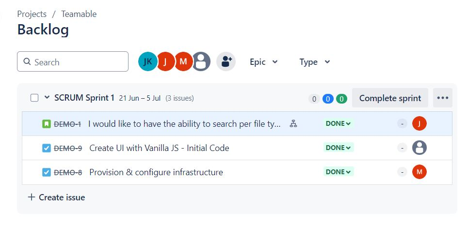

# Teamable

## Overview

In this project I am demonstrating how I created the first phase of my project website. 

## Technologies Used

- **Languages:** HTML, CSS, JavaScript
- **Project Management:** JIRA
- **Package Manager:** NPM
- **Modules Used:** Validator module (for email format validation), Date picker module (for selecting dates)

## Project Details

This is the first phase of the project where I have built only some of the core functionalities of the website. To roll out the 1st phase of the website I have utilized JIRA so I track my project. I have created a story, where the user would typically provide information such as their Full Name, Email address, some of their Interests as well as a Date picker which would allow them to indicate when that information was filled. Once a story was set, I broke down the request to Tasks over JIRA while linking/referencing them to the original story. From there I've inserted the task to my bi-weekly implementation sprint. 

Some of the first phase website features are listed below

### Features

- Implemented a date picker to allow users to select dates.
- Utilized the validator module to check email formats and provide user feedback.

Initially when I've created the core concept of the website based on the JIRA tasks, it only included a picture with the information fields that the user would typically fill out. Based on the data entry, I made a hypothesis and created a product enhancement feature where I would install NPM package modules for this project. That would provide us with the opportunity to create some parameters for the website where the system would check if the user has provided a correct email format as well as providing the user with the ability to pick the date of when they filled out that form. 

## Usage

This is only the first implementation and the notion behind it was to allow us to work with open source libraries that we could implement in the project with the power of npm. We wanted to go through that route as I would like to further enrich the website by utilizing other libraries as well as Vue.js in the future.

## Screenshots
Here is a screenshot of the JIRA Sprint: 

Here is a screenshot of the validator prompting the user to provide a correct email format: 

Here is a screenshot of the DatePicker: 

## Acknowledgements
Libraries used:

([Validator.js](https://github.com/validatorjs/validator.js))

([Datepicker.js](https://wwilsman.github.io/Datepicker.js/))

I would like to thank ([Wil Wilsman](https://github.com/wwilsman)) for creating such a unique yet simple Datepicker layout. 

I would like to thank ([Chris O'Hara](https://github.com/chriso)) & the contributors that have kept that validator.js up and running for many years.  

